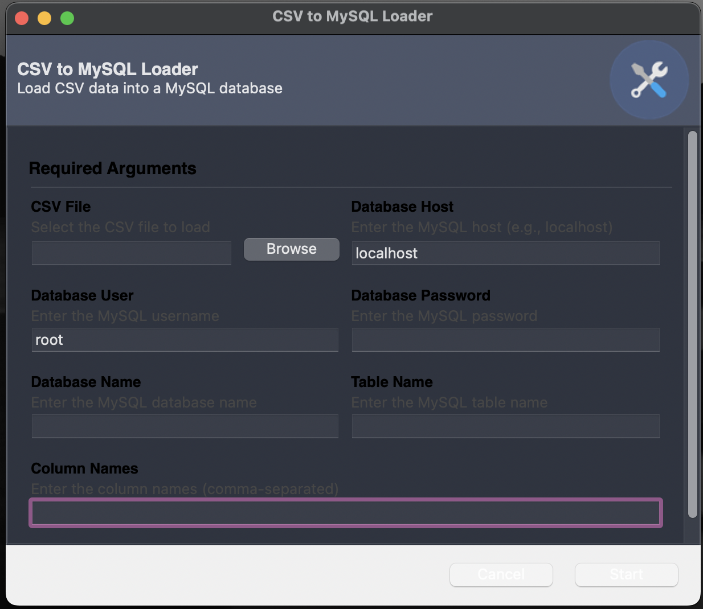

# CSV to MySQL Loader


A Python-based GUI application that allows users to load CSV data into a MySQL database. The application provides flexibility for users to define their own database structure and column names for accurate data mapping.

---

## Features
- **User-Friendly GUI**: Built with Gooey for an intuitive interface.
- **Flexible Database Structure**: Users can define their own database tables and column names.
- **Batch Insertion**: Data is inserted in batches for improved performance.
- **Error Handling**: Failed rows are logged, and the application continues processing the rest of the data.

---

## Prerequisites
Before using this application, ensure you have the following installed:
- **Python 3.7 or higher**
- **MySQL Server** (locally or remotely)
- **MySQL Connector/Python** (installed via `pip`)

---

## Installation
1. Clone this repository:
   ```bash
   git clone https://github.com/your-username/csv-to-mysql-loader.git
   cd csv-to-mysql-loader
   

### Screenshot:
